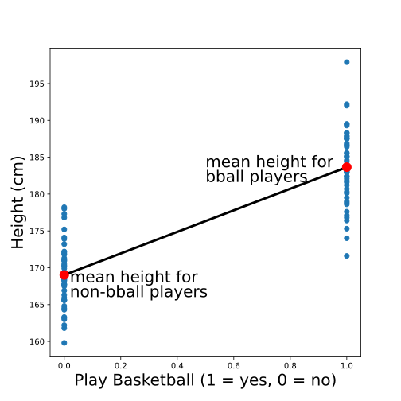
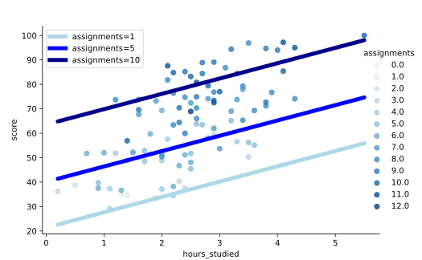
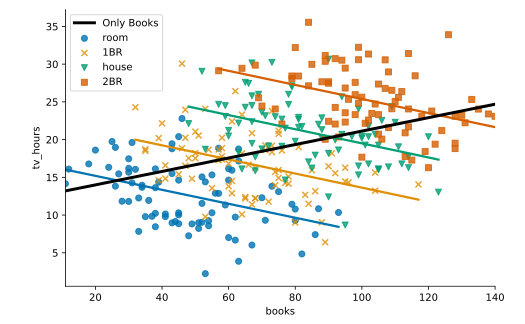
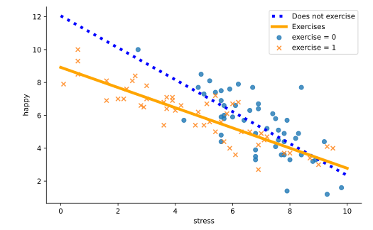

# Linear regression

Predictor: X  
Outcome: Y  
Intercept and slope.

## Residuals

Measured values - fitted values

## Normality assumption

Residuals should be normally distributed (Gaussian).
If they are skewed (Poisson) there is no normality.

## Homoscedasticity assumption

Residuals have equal variation across all values of the predictor variable.

A common way to check this is by plotting the residuals against the fitted values.
This plot will look like a random splatter of points, centered around Y=0.
If there are any patterns or asymmetry, that would indicate the assumption is NOT met and linear regression may not be appropriate.

## Quantitative and Categorical predictors

Quantitative predictors are numeric (1, 2, 3).
Categorical predictors are categories (Can swim (1 or True), can not swim (0 or False).

For categorical predictors:
* The intercept is the **mean** of the outcomes at the predictor value of zero.
* The slope is the difference in the **mean** of the outcomes between two values of the predictor.


> "_The image shows the intercept and slope for two categories, the height of baseball players and non baseball players._"

# Multiple regression

Y = b<sub>0</sub>​ +
b<sub>1</sub>X<sub>1</sub> ​+
b<sub>2</sub>​X<sub>2</sub> ​+ ... +
b<sub>i</sub>​X<sub>i</sub>

**b<sub>0</sub>:** intercept  
**b<sub>i</sub>:** partial regression coefficients

```python
from statsmodels import api
model = api.OLS.from_formula('portuguese3 ~ math1 + address', data=students).fit()
```

Leaving all other variables constant, the score of students who ate breakfast was 22.5 points greater.

```python
ate_breakfast = [0, 1]

breakfast_score = 32.7 + 8.5 * hours_studied + 22.5 * 1
                = 55.2 + 8.5 * hours_studied​​

no_breakfast_score = 32.7 + 8.5 * hours_studied + 22.5 * 0
                   = 32.7 + 8.5 * hours_studied​
```

If instead of a categorical variable we have a numeric variable, leaving all other variables constant, the outcome is **b<sub>i</sub>** units greater for every increase in one unit of the numeric variable.


> "_Leaving all other predictors constant, a change in a predictor changes the intercept._"


## Simpson's Paradox

One model says the direction of the relationship is positive, while the other says it is negative.


> "_The fit of the whole is different to the fits of the parts_"

## Multicollinearity

When predictors are linearly related, which can lead to misleading results.

We can check the correlations, if they are close to 1 or -1 they may be too closely related to both be included in a model.

## Interaction terms

When leaving all variables constant and modifying one, not only the intercept changes, but also the slope. In that case, we need to model it with an extra parameter: the product of the variables.

Y = b<sub>0</sub>​ + b<sub>1</sub>X<sub>1</sub> ​+ b<sub>2</sub>​X<sub>2</sub> + b<sub>12</sub>X<sub>1</sub>X<sub>2</sub>

```python
from statsmodels import api

formula = 'height ~ weight + species + weight:species'
model = api.OLS.from_formula(formula, data=plants).fit()
```


> "_The extra interaction term contributes a change in slope._"

## Polynomial terms

If curved:

Y = b<sub>0</sub>​ + b<sub>1</sub>X ​+ b<sub>2</sub>X<sup>2</sup>

```python
import numpy
from statsmodels import api

formula = 'happy ~ sleep + numpy.power(sleep, 2)'
model = api.OLS.from_formula(formula, data=happiness).fit()
```

Although we can add interaction and polynomial terms to a multiple regression model, the model is still considered a multiple LINEAR regression model because the COEFFICIENTS themselves are not raised to higher powers or multiplied by one another.

In other words, the model does not consider the polynomial or interaction terms any differently than any other variable; when we add an interaction or polynomial term, it's like we're just adding another predictor to the model that happens to be a composite of some of the other predictors.

# Choosing a model

**Nested models:** same predictors than the other model, plus an extra group of predictors.

Which to choose? Consider your ultimate goal (analysis vs. prediction) and what you want to prioritize (simplicity and interpretability vs. accuracy).

## Methods for finding a model that best fits an observed set of data

* **R-squared:** is the % of variation in an outcome variable that is explained by a linear regression model. Adding more predictors increases R2, but may also overfit.
Each predictor we add increases R2 a litle bit less than the previous one.

* **Adjusted R-squared:** gives a small penalty for each additional predictor in a model.

* **F test:** has two hypothesis: null hypothesis when the extra predictors have no influence (coefficients are zero) or alternative hypothesis when they do. If they have no influence, the probability of observing a higher F is above 0.05.

## Methods for finding a model that best predicts new/unobserved data

* **Log-Likelihood:** measures the probability of observing our data given a particular model.  Higher log-likelihood is better. Increases as we add more predictors to a model.

* **AIC/BIC:** Akaike information criterion (AIC) and Bayesian information criterion (BIC). Penalize extra predictors. Lowest AIC/BIC is better. BIC gives bigger penalty, so it is used for finding the best "simple" model.

* **Train/test split:** split the data in 80% training, use it to fit the model, then use the test data to predict. With a metric we can compare the prediction with the measured value. For example, the predictive root mean squared error (PRMSE). Lowest PRMSE is better. It's **√mean(true - fitted)<sup>2</sup>**.


# Next

* [Full cheatsheets](https://www.codecademy.com/learn/linear-regression-mssp/modules/simple-linear-regression-mssp/cheatsheet)
* [Linear Regression in Scikit-Learn (sklearn): An Introduction](https://datagy.io/python-sklearn-linear-regression/)
* [Introduction to regression models](https://kirenz.github.io/regression/docs/intro.html)
