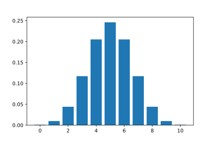
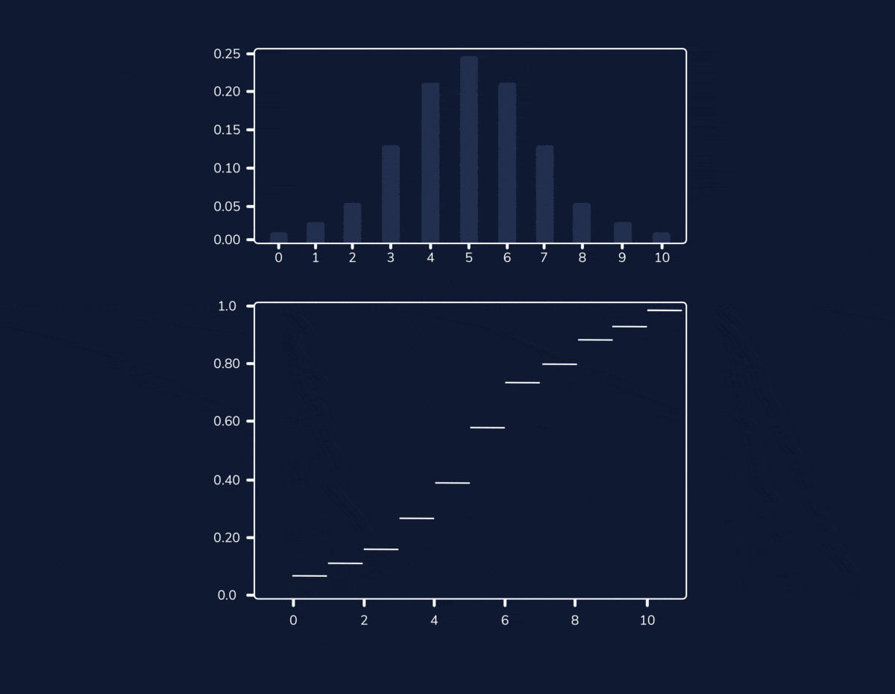
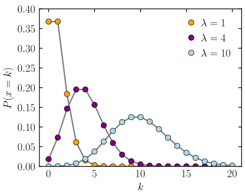
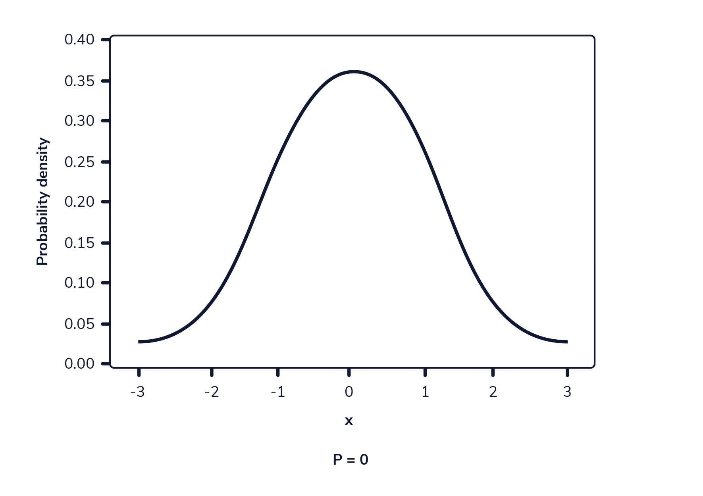

# Probability distributions


## Probability Mass Functions

PMF is a distribution that defines the probability of observing a particular value of a **discrete** random variable.

* Discrete random: dice  
* Continuous random: temperature

The probabilities of the histogram add up to 1.


### Binomial distribution

Discrete probability distribution of the number of successes in `n` independent experiments. The probability of a success outcome is `p`. If the draws are not independent, the distribution is hypergeometric rather than binomial.

* The expected value of the binomial distribution is `n·p`.  
* The variance is the probability that the success happens times the probability that it does not happen: `p·(1 - p)`.   
For `n` trials: `n·p·(1 - p)`.


> "_The probability of observing 3 heads out of 10 trials is 0.14. The maximum probability is for observing 5 heads out of 10 trials, since success probability is one half._"

```python
from scipy.stats import binom

trials = 10
success_probability = 0.5

probability_of_3 = binom.pmf(3, trials, success_probability)
less_than_3 = sum(binom.pmf(events, trials, success_probability) for events in range(4))
more_than_3 = 1 - less_than_3
```


### Cumulative Distribution

Probability in a range: sum the probabilities.  
For example, the probability of getting 1, 2, or 3 heads is P1 + P2 + P3.


> "_Probability of observing less than a number of events._"

```python
from scipy.stats import binom

trials = 10
success = 0.5

three_or_less = binom.cdf(3, trials, success)
more_than_five = 1 - binom.cdf(5, trials, success)
between_two_and_five = binom.cdf(5, trials, success) - binom.cdf(1, trials, success)
```

### Poisson distribution

Discrete probability distribution for the probability of a given number of events occurring in a fixed interval. The mean is `λ`.


> "_Poisson distribution for different values of `λ`._"


```python
from scipy.stats import poisson

mean = 0.5

probability_of_3 = poisson.pmf(3, mean)
less_than_3 = sum(poisson.pmf(events, mean) for events in range(3))

# Cumulative
less_than_3 = poisson.cdf(2, mean)
more_than_3 = 1 - poisson.cdf(2, mean)
between_2_and_3 = poisson.cdf(3, mean) - poisson.cdf(1, mean)
```

* The expected value of a Poisson distribution is the mean.
* The variance of a Poisson distribution is also the mean. That's why the distribution spreads for high means.

```python
import numpy
from scipy.stats import poisson

distribution = poisson.rvs(mean, size=1000)
print(distribution.mean())
print(numpy.var(distribution))
```


## Probability Density Functions

PDF is a distribution that defines the probability of observing a particular value of a **continuous** random variable.

It's a curve of area 1. The probability at a single point is zero (the area of the curve underneath a point).


### Normal distribution (Gaussian)

Normal distributions are described by their mean `μ` (mu) and standard deviation `σ` (sigma).


> "_Cumulative probability on a normal distribution. The probability at any point is zero._"

```python
from scipy.stats import norm

mean = 167.64
deviation = 8

less_than_175 = norm.cdf(175, mean, deviation)
more_than_175 = 1 - norm.cdf(175, mean, deviation)
between_172_and_175 = norm.cdf(175, mean, deviation) - norm.cdf(172, mean, deviation)
```

## Properties

### Properties of expectation values

* The expected value of two independent random variables is the sum: E(x + y) = E(x) + E(y)

* Multiplying a random variable by a constant changes the expected value to times the constant: E(Cx) = CE(x)

* Adding a constant to the random variable changes the expected value by the constant: E(x + C) = E(x) + C

### Properties of variances

* Increasing the values in a distribution by a constant a does not change the variance This is because the variance of a constant is zero (there is no range for a single number): Var(x + C) = Var(x)

* Multiplying a random variable by a constant scales the variance by the constant squared: Var(Cx) = C<sup>2</sup>Var(x)

* The variance of the sum of two _independent_ random variables is the sum of the individual variances: Var(x + y) = Var(x) + Var(y)
