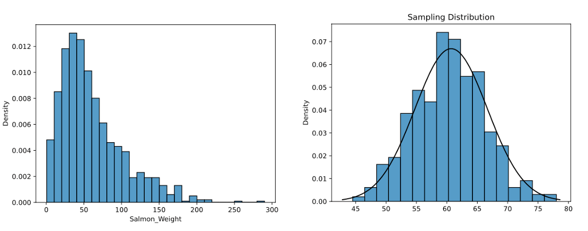
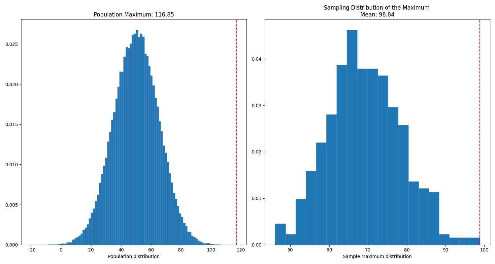

# Sampling distributions

When you don't have access to the whole universe of data points, all you can do is measure a sample and interpolate.

The idea is you take a group of samples of the same size and calculate means for different statistics: mean of the mean, mean of the maximum value, etc.

## Central Limit Theorem

When independent random variables are summed up, their normalized sum tends to a normal distribution, even if the original variables themselves are not normally distributed.

Implies that probabilistic and statistical methods that work for normal distributions may work for other distributions.

The sampling distribution of the mean:

* is normally distributed (if population not skewed, or skewed but sample size is large enough, ~ `n > 30`),
* has a mean equal to the population mean,
* has standard deviation equal to the population standard deviation divided by the square root of the sample size (`σ / √n`).​

Small `σ` and big `n` make this deviation smaller.


> "_The mean of means of a group of samples of a population is approximately the mean of the population. Generated with `central-limit-theorem.py`._"

Once we know the sampling distribution of the mean, we can use it to estimate the probability of observing a particular range of sample means, given some information about the population.

```python
# Can we carry 25 cod of 36lbs in a crate of 750lbs?
mean = 36
deviation = 20
size = 25
standard_error = deviation / (size**.5)

# probability that a sample of 25 fish has a mean weight of 30lbs
less_than_30 = stats.norm.cdf(30, mean, standard_error)
```


## Estimators

**Unbiased:** when the mean of the statistic is equal to the population For example, the samples means mean is the population mean.

**Biased:** the samples maximum mean is not the population maximum.


> "_The maximum is a biased estimator because the mean across several samples is not the population's maximum. . Generated with `biased-estimators.py`._"
